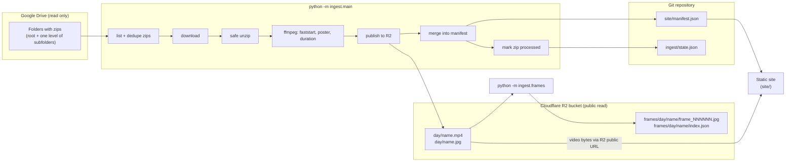
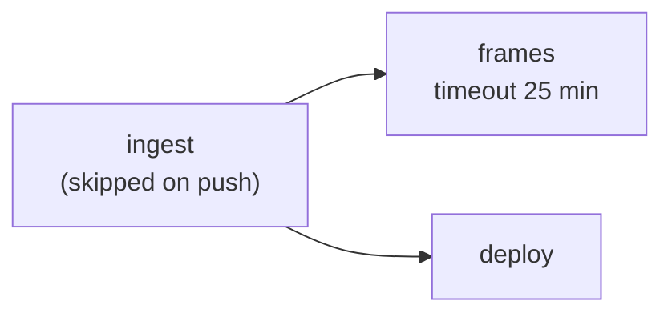

# poseCamData architecture

poseCamData is a daily video gallery. Zipped camera recordings are uploaded to Google Drive; a Python ingest pipeline downloads them, publishes the videos to Cloudflare R2, and records them in `site/manifest.json`; a static website reads that manifest and plays the videos from R2. A second, separate step extracts still frames from the published videos and stores them in R2.

This document describes the system as the code stands on branch `feat/frames-pipeline`. Every claim points to a source file. Anything that could not be confirmed from the repository is marked **unverified**.

## Contents

1. [Overview](#1-overview)
2. [Components and where they run today](#2-components-and-where-they-run-today)
3. [Ingest pipeline, step by step](#3-ingest-pipeline-step-by-step)
4. [Code architecture](#4-code-architecture)
5. [Frames step](#5-frames-step)
6. [Data contracts](#6-data-contracts)
7. [Website](#7-website)
8. [Configuration](#8-configuration)
9. [Running it locally](#9-running-it-locally)
10. [What the system needs to keep working (migration checklist)](#10-what-the-system-needs-to-keep-working-migration-checklist)
11. [Known limitations and open items](#11-known-limitations-and-open-items)
12. [Discrepancies between sources](#12-discrepancies-between-sources)

---

## 1. Overview

**Purpose.** Recordings are uploaded as zip files to shared Google Drive folders. Viewers cannot watch a zip, so the system extracts the videos and shows them on a public website, grouped by category and by day, playable in the browser (`odd/tasks/video-gallery.md`, "Objective" and "Problem").

**Users.**

- Uploaders put zips in Drive folders. The manifest stores their Drive display name as `uploader`; e-mail addresses are never read (`ingest/adapters/drive.py`, `_owner_name`).
- Viewers open the static site. It is public (`odd/tasks/video-gallery.md`, "Constraints").
- A maintainer runs or monitors the pipeline.

**Full flow.**



Reading the diagram: the ingest writes videos and posters to R2 and writes the manifest and state files into the repository. The site reads only `manifest.json` (served with the site) and fetches video and poster bytes directly from R2 URLs that are stored inside the manifest. The frames step reads the videos back from R2 and writes frames next to them; nothing on the site reads frames (no reference to frames exists in `site/app.js` or `site/lib.js`).

---

## 2. Components and where they run today

| Component | What it is | Where it runs today | Defined in |
|---|---|---|---|
| Google Drive folders | Source of zips. Read with a Google API key (folders shared as "anyone with the link") or, as an alternative, a service account file. | Google | `ingest/adapters/drive.py`, `README.md` |
| Ingest job | `python -m ingest.main`, or `python -m ingest.posters` when run manually in `posters` mode. Commits `site/manifest.json` and `ingest/state.json` back to `main`. | GitHub Actions, job `ingest` | `.github/workflows/ingest.yml` |
| Frames job | `python -m ingest.frames`. Reads and writes R2 only. | GitHub Actions, job `frames` | `.github/workflows/ingest.yml` |
| Deploy job | Publishes the `site/` directory. | GitHub Actions, job `deploy`, to GitHub Pages | `.github/workflows/ingest.yml` |
| CI | Python and Node tests on every push and pull request. | GitHub Actions, job `test` | `.github/workflows/ci.yml` |
| Cloudflare R2 | Object storage for videos, posters and frames. Bucket must be publicly readable. Accessed through its S3-compatible API with boto3. | Cloudflare | `ingest/adapters/r2.py`, `ingest/frames.py` |
| Static site | Plain HTML, CSS and ES-module JavaScript, no build step. | GitHub Pages (public URL recorded in `odd/tasks/video-gallery.md`) | `site/` |

### 2.1 The GitHub Actions workflow

File: `.github/workflows/ingest.yml`, workflow name "Ingest and deploy".

**Triggers**

| Trigger | Detail |
|---|---|
| `schedule` | Cron `*/30 * * * *` (every 30 minutes). |
| `workflow_dispatch` | Input `mode`, a choice of `ingest` (default) or `posters`. |
| `push` to `main` | Only the deploy job does work (see below). |

**Concurrency.** Group `ingest-deploy-${{ github.ref }}`, `cancel-in-progress: false`. Runs on the same ref queue instead of cancelling each other. The `frames` job stays inside the group until it ends, which is why it has a per-run limit and a 25-minute timeout (comment in the workflow).

**Jobs and order**



1. `ingest` runs unless the event is a `push`. Steps: checkout `main`, Python 3.12 with pip cache, `pip install -r requirements.txt`, restore or download a static ffmpeg build, run ingest, then commit and push.
   - The run step executes `python -m ingest.posters` when `inputs.mode == posters`, otherwise `python -m ingest.main`.
   - The commit step runs `if: !cancelled()`, so it runs even when ingest failed. It configures the `github-actions[bot]` identity, runs `git add site/manifest.json ingest/state.json`, and, if something is staged, commits with the message `chore(ingest): update manifest and state` and pushes `HEAD:main`.
   - Permissions: `contents: write`.
2. `frames` has `needs: ingest`. It runs when `!cancelled()`, `ingest` was not skipped, and `inputs.mode != 'posters'`. It therefore runs after a failed ingest as well. It checks out `main`, installs the same dependencies and ffmpeg, and runs `python -m ingest.frames`. Permissions: `contents: read`. It runs in parallel with `deploy`, so the site never waits for frames.
3. `deploy` has `needs: ingest` and runs when ingest succeeded or was skipped. It checks out `main`, uploads the `site` directory with `actions/upload-pages-artifact@v3`, and deploys with `actions/deploy-pages@v4` to the `github-pages` environment. Permissions: `pages: write`, `id-token: write`.

On a push to `main` the `ingest` job is skipped, `frames` is skipped (its condition excludes a skipped ingest), and only `deploy` runs, publishing the pushed content.

**What gets committed back to the repository.** Only `site/manifest.json` and `ingest/state.json`, by the `ingest` job, directly to `main` (see section 10.3 for the state of `ingest/state.json` in git).

**ffmpeg in CI.** A static build is downloaded from `https://github.com/BtbN/FFmpeg-Builds/releases/download/latest/ffmpeg-master-latest-linux64-gpl.tar.xz`, cached under `~/ffmpeg-bin` with cache key `ffmpeg-static-linux64-v1`, and put on `PATH`. The workflow comment says apt mirrors had hung that step. The URL points at a rolling release with no checksum or pin.

### 2.2 The CI workflow

File: `.github/workflows/ci.yml`. Triggers: `pull_request` and `push` on every branch. It installs `requirements-dev.txt` only (that file contains just `pytest`), runs `python -m pytest -q`, sets up Node 22, and runs `node --test site/tests/app.test.mjs`. Because only `pytest` is installed, the Python tests must not need `boto3` or the Google client libraries; the adapters import them lazily and the tests inject fakes (module docstrings of `ingest/adapters/drive.py` and `ingest/adapters/r2.py`).

---

## 3. Ingest pipeline, step by step

Entry point: `ingest/main.py` (`python -m ingest.main`). Core logic: `run_ingest` in `ingest/use_case.py`.

### 3.1 Start-up

1. `main()` loads `.env` from the repository root if it exists. Variables already in the environment win over the file (`apply_dotenv`). The parser supports `KEY=VALUE`, blank lines and `#` comments only.
2. `load_config` builds a frozen `Config` and raises `ValueError` listing every missing required name. `main()` prints it to stderr and exits 1. Required: Drive sources, Google credentials (API key or service account file), the R2 account id, access key id, secret key, public base URL and bucket name (see section 8).
3. `run(config)` builds the Drive source, the R2 publisher and the state store, and calls `run_ingest` with an ffmpeg processor.
4. `main()` prints a JSON report `{"processed": [...], "skipped": [...], "failed": {...}, "deferred": [...]}` and exits 1 if `failed` is not empty.

### 3.2 Discovering zips (Drive)

Implemented in `DriveZipSource.list_zips` (`ingest/adapters/drive.py`).

- **Sources.** `DRIVE_SOURCES` is a comma-separated list of `folderId[=Category]`. One `DriveZipSource` is built per item and `MultiZipSource` (`ingest/main.py`) concatenates them and routes each download to the source that listed the zip. If `DRIVE_SOURCES` is empty and `DRIVE_FOLDER_ID` is set, that single folder is used with the category `Black/White pipes`.
- **Where it looks.** Zips directly in the folder, and zips in its immediate subfolders. It does not recurse deeper. Queries ignore trashed files and page through results 100 at a time.
- **What counts as a zip.** A file whose MIME type is `application/zip` or `application/x-zip-compressed`, or whose name contains `.zip`; the file is then kept if its name ends in `.zip` (case-insensitive) or its MIME type is one of the two zip types. This handles uploads that lost the extension (`PoseCam capture-...-pipeline`).
- **Category.**
  - A source label (after `=`) wins for every zip in that source.
  - Otherwise the category is the immediate subfolder name, trimmed. Zips at the folder root get no category.
  - A subfolder whose name parses as a date (`DD-MM-YYYY`) is treated as a day, never as a category.
  - The category is later normalised in the manifest (section 3.9).
- **Day.** Taken from the zip name if it contains `capture-YYYYMMDDTHHMMSS` (regex `capture-(\d{8})T\d{6}`); otherwise from a `DD-MM-YYYY` subfolder name; otherwise, in the use case, from the zip's Drive `createdTime` date (`entry.uploaded_at.date()`).
- **Uploader.** The first owner with a non-empty `displayName`. Nothing else about owners is requested beyond `owners(displayName)`.
- **Dedupe.** `_dedupe_entries` keeps one entry per `(category, normalised name)`, where normalising removes a trailing ` (N)` copy counter. When both a numbered copy and the un-numbered original exist, the original is preferred.
- **Authentication.** With `GOOGLE_API_KEY`, the Drive client is built with `developerKey` (works only for folders shared as "anyone with the link"). Otherwise a service account JSON file is loaded with the `drive.readonly` scope. The API key takes priority when both are set.

### 3.3 "Already processed" tracking

`JsonStateStore` (`ingest/state.py`) reads `ingest/state.json` (path overridable with `STATE_PATH`). A zip is identified by its Drive file id. In `run_ingest`, ids found in the state are put in `report.skipped` and not downloaded. State is the only record of what was processed; the manifest is not consulted for this.

To reprocess a zip, remove its id from `ingest/state.json` and run the ingest again (`README.md`, "Operations").

### 3.4 Ordering and the per-run limit

Pending zips are sorted by `(day or upload date, uploaded_at)`, oldest first. If `MAX_ZIPS_PER_RUN` (default 10) is set, the first N are processed and the rest are returned as `deferred`; later runs pick them up. The workflow passes `vars.MAX_ZIPS_PER_RUN || '10'`.

### 3.5 Per-zip processing

For each pending zip, inside `try/except/finally` in `run_ingest`:

1. **Download.** Into `<workdir>/<zip id>/<zip name>`. `workdir` is `WORKDIR` or a fresh temp directory (`tempfile.mkdtemp(prefix="ingest-")`). Download uses `MediaIoBaseDownload` in chunks.
2. **Safe unzip.** `extract_videos` (`ingest/unzip.py`) walks the archive entries and skips directory entries, absolute paths and any path containing `..`. It keeps only files with extension `.mp4`, `.mov`, `.mkv`, `.webm` or `.avi` (case-insensitive) and writes each to the target directory under its base name only, so any folder structure inside the zip is flattened.
3. **Video processing** (`FfmpegProcessor.process`, `ingest/adapters/ffmpeg.py`), per video:
   - Remux with `-c copy -movflags +faststart` (no re-encode) so the browser can start playing without reading the end of the file. If the remux fails, the original file is published instead.
   - Poster: one frame at `-ss 1`, scaled with `scale=640:-2`, `-q:v 4`, written as `<stem>.jpg`. If this fails, there is no poster.
   - Duration via `ffprobe -show_entries format=duration`, `None` if it fails.
   - ffmpeg failures never raise; they are logged to stderr.
   - If the `ffmpeg` binary (`FFMPEG_BIN`, default `ffmpeg`) is not found on `PATH`, `build_processor` returns `NoopProcessor` and posters, faststart and duration are skipped with a log message.
   - The ffprobe binary is `FFPROBE_BIN`, or the ffmpeg binary path with `ffmpeg` replaced by `ffprobe`.
4. **Publish** (`R2VideoPublisher.publish`, `ingest/adapters/r2.py`): uploads the video to `<day>/<file name>` and the poster, if any, to `<day>/<stem>.jpg`. Content type of the video is guessed from the file name with `mimetypes`, falling back to `application/octet-stream`; the poster is `image/jpeg`. The duration from step 3 is added to the returned `PublishedVideo`.
5. **Manifest.** After all videos of the zip are published, one `Manifest` is saved with `save()` (merge, see section 3.7).
6. **Cleanup.** The `finally` block deletes the zip's working directory (`shutil.rmtree`), on success and on failure.
7. **State.** Only after the manifest was saved successfully, `state.mark_processed(zip id)` is called and the id is added to `report.processed`.

### 3.6 Failure handling per zip

An exception anywhere in steps 1 to 5 is recorded as `report.failed[zip id] = message` and the loop continues with the next zip. A failed zip is not marked processed, so the next run retries it. Files already uploaded to R2 for that zip stay there; because R2 keys are deterministic (`<day>/<file name>`), a retry overwrites them and the manifest merge is keyed by video id, so retries do not create duplicates. The process exits 1 if any zip failed. In the workflow the commit step still runs after a failure (`!cancelled()`), which was added because a Drive 403 throttle once left published videos unrecorded (`odd/tasks/video-gallery.md`, 2026-09-28).

A zip that contains no recognised video files is saved as an empty manifest and then marked processed.

### 3.7 Manifest merge

`save()` in `ingest/manifest.py` loads the existing file (empty if absent), merges the new videos per day keyed by video id (a new record replaces an older one with the same id), then rewrites the whole file with `json.dumps(indent=2)`. `generated_at` is set to the current UTC time on every save. Days are written newest first and videos within a day sorted by name ascending. The site re-sorts videos newest first (section 7).

### 3.8 Poster and duration backfill

`python -m ingest.posters` (`ingest/posters.py`) handles videos that were published before posters or durations existed. It reads `site/manifest.json` (or `MANIFEST_PATH`) and selects videos with no `poster` or a `null` duration, up to `MAX_ZIPS_PER_RUN` (default 10; the same variable is reused as the video limit). For each one it downloads the video from R2 using the video `id` as the key, and:

- if the video already has a poster, it only probes the duration and updates the manifest;
- otherwise it remuxes, generates the poster, uploads the remuxed video back to the same key and the poster to `<day>/<stem>.jpg`, then updates `duration` and `poster`.

The manifest is saved after each video. It prints `{"updated", "durations", "failed", "remaining"}` and exits 1 only if something failed and nothing was updated. It needs only R2 variables, not Drive. In the workflow it runs only on a manual dispatch with `mode = posters`.

### 3.9 Category normalisation

`normalize_category` (`ingest/manifest.py`) removes a trailing date from a category name, for example `Black pipes 1 Oct` becomes `Black pipes`. Only real month names (full or abbreviated) followed or preceded by a day number are matched, so `Deck 1` or `Mark 2` are untouched. It is applied in `Manifest.add` and `Manifest.from_dict`. An empty or non-text category becomes `Black/White pipes` (`DEFAULT_CATEGORY`).

### 3.10 Uploader backfill

`python -m ingest.uploaders` (`ingest/uploaders.py`) fills a missing `uploader` (and missing `category`, set to `Black/White pipes`) on existing manifest entries by matching `source_zip` to the Drive listing (ignoring a trailing ` (N)`). It reads Drive metadata only; it needs `DRIVE_SOURCES` (or `DRIVE_FOLDER_ID`) and `GOOGLE_API_KEY` (not the service account) and does not touch R2. It is not wired into the workflow. A video that cannot be matched gets `uploader: null`.

---

## 4. Code architecture

The ingest follows a ports-and-adapters (hexagonal) layout. The use cases depend on small protocols; concrete adapters are passed in.

```
ingest/
  ports.py        Protocols and value objects (the boundary)
  use_case.py     run_ingest: ingest orchestration (core)
  unzip.py        safe zip extraction (core helper)
  manifest.py     Manifest model, normalisation, merge and save (core)
  state.py        JsonStateStore: StateStore implementation (file-backed)
  uploaders.py    uploader backfill command
  posters.py      poster/duration backfill command (use case + CLI)
  frames.py       frames use case + CLI
  main.py         ingest CLI, configuration, .env loading, wiring
  adapters/
    drive.py      ZipSource   -> Google Drive
    r2.py         VideoPublisher -> Cloudflare R2
    ffmpeg.py     VideoProcessor -> ffmpeg/ffprobe (+ NoopProcessor)
    frames.py     FrameExtractor -> ffmpeg/ffprobe
  tests/          pytest suite (one test module per component)
```

### 4.1 Ports (`ingest/ports.py`)

| Port | Methods | Implemented by |
|---|---|---|
| `ZipSource` | `list_zips() -> list[ZipEntry]`, `download(entry, dest) -> Path` | `DriveZipSource` (`adapters/drive.py`), `MultiZipSource` (`main.py`) |
| `VideoPublisher` | `publish(video_path, day, poster_path=None) -> PublishedVideo` | `R2VideoPublisher` (`adapters/r2.py`) |
| `StateStore` | `processed_ids()`, `mark_processed(zip_id)` | `JsonStateStore` (`state.py`) |
| `VideoProcessor` | `process(video_path, workdir) -> ProcessedVideo` | `FfmpegProcessor`, `NoopProcessor` (`adapters/ffmpeg.py`) |
| `FrameExtractor` | `extract(video_path, out_dir, fps) -> ExtractedFrames` | `FfmpegFrameExtractor` (`adapters/frames.py`) |

Value objects in the same file: `ZipEntry(id, name, uploaded_at, day, category, uploader)`, `PublishedVideo(id, name, url, poster_url, duration_seconds)`, `ProcessedVideo(video_path, poster_path, duration_seconds)`, `ExtractedFrames(frames, timestamps, duration, start_time)`.

### 4.2 Dependency injection

- `run_ingest(source, publisher, state, manifest_path, workdir, max_zips, processor)` receives all collaborators as arguments (`ingest/use_case.py`).
- `ingest/main.py` exposes builder callables `DEFAULT_SOURCE_BUILDER` and `DEFAULT_PUBLISHER_BUILDER`; `run(config, source_builder, publisher_builder)` accepts replacements, which is how `ingest/tests/test_main.py` runs the wiring without real services.
- The real clients are created only inside factory functions (`build_drive_source`, `build_drive_source_with_api_key`, `build_r2_publisher`, `_build_client` in `frames.py`) that import `googleapiclient`, `google.oauth2` and `boto3` lazily. Adapters receive an already-built client object (duck-typed), so tests pass fakes.
- `FfmpegProcessor` and `FfmpegFrameExtractor` take a `runner` argument (default `subprocess.run`) that tests replace.
- `ingest/frames.py` `main()` takes `client_factory`, `extractor`, `env` and `dotenv_path` arguments for the same reason.

### 4.3 Entry points

| Command | Module | What it wires |
|---|---|---|
| `python -m ingest.main` | `ingest/main.py` | Drive source(s), R2 publisher, `JsonStateStore`, ffmpeg processor, then `run_ingest`. |
| `python -m ingest.posters` | `ingest/posters.py` | Builds a boto3 client directly, the ffmpeg processor, then `run_posters`. Reuses `load_dotenv_file` from `ingest.main`. |
| `python -m ingest.frames` | `ingest/frames.py` | Builds a boto3 client (with larger connection pool and adaptive retries) and `FfmpegFrameExtractor`, then `run_frames`. Reuses `load_dotenv_file`. |
| `python -m ingest.uploaders` | `ingest/uploaders.py` | Drive sources (API key only), then `backfill_uploaders`. |

Note that `ingest/posters.py` and `ingest/frames.py` use boto3 clients directly instead of the `VideoPublisher` port, because they need download, list and head operations that the port does not define.

### 4.4 Tests

`ingest/tests/` has one module per component (`test_use_case`, `test_drive_source`, `test_r2_publisher`, `test_ffmpeg_processor`, `test_frame_extractor`, `test_frames`, `test_posters`, `test_manifest`, `test_state`, `test_unzip`, `test_uploaders`, `test_main`). `pyproject.toml` sets `testpaths = ["ingest/tests"]`. No real ffmpeg, Drive or R2 is used.

---

## 5. Frames step

Module: `ingest/frames.py`, adapter `ingest/adapters/frames.py`, command `python -m ingest.frames`.

**What it does.** For every `.mp4` object in the R2 bucket (extension compared case-insensitively, keys starting with `frames/` excluded), it downloads the video, samples it at a fixed frame rate, uploads the frames, and writes an `index.json` that marks the video as done.

**When it runs.** It is independent of the manifest: it lists the bucket, not `site/manifest.json`. In the GitHub workflow it runs as the `frames` job after `ingest` and in parallel with `deploy`, so videos are in R2 and on the site first (`odd/tasks/frames-pipeline.md`, "Constraints"). It can also be run by hand at any time.

**Finding pending videos.**

1. `list_videos` pages through `list_objects_v2` for the whole bucket and sorts matching keys alphabetically (so older days come first).
2. For each video it calls `head_object` on `frames/<key without extension>/index.json` (using a thread pool of `--workers`). A video whose index exists is `skipped`. A "not found" error (`404`, `NoSuchKey`, `NotFound`) means pending; any other error is raised.

**Processing each pending video** (`_process_video`), strictly one video at a time:

1. Download to a temporary directory (under `--tmp-dir`, else `WORKDIR`, else the system temp dir).
2. `ffprobe` for `format=duration,start_time` (and stream frame-rate fields).
3. `ffmpeg -vf fps=<fps>,showinfo -vsync passthrough -q:v 3` writes `frame_%06d.jpg`; the `pts_time` of each frame is read from the `showinfo` log lines. These arguments are frozen so frames stay identical to those from the earlier standalone script (`odd/tasks/frames-pipeline.md`).
4. If the number of timestamps differs from the number of frames, a warning is logged and timestamps are computed as `start_time + i / fps`.
5. Frames are uploaded concurrently (`--workers`, default 24) with content type `image/jpeg`. If one upload fails the remaining queued uploads are cancelled and the video fails.
6. `index.json` is uploaded last with content type `application/json`. **Its presence is the completion marker.** A crash before this point leaves a partial set of frames but no index, so the video is retried on the next run (frame keys are overwritten).

**Limit semantics.** `--limit N` (default from `MAX_FRAME_VIDEOS_PER_RUN`, otherwise no limit) stops the run after N videos were **successfully** processed. Failed videos do not count, so videos that always fail cannot starve the rest of the queue. The CI workflow sets `MAX_FRAME_VIDEOS_PER_RUN` to `vars.MAX_FRAME_VIDEOS_PER_RUN || '10'`.

**Timeout.** `--timeout` (default 600 seconds, `0` disables) is passed to each `ffprobe` and `ffmpeg` call (it is per call, not per video). A timeout raises an error that fails that video like any other. The workflow job itself has `timeout-minutes: 25`.

**Failure behaviour.** Any exception for a video is recorded in `report.failed`, logged as `FAILED: ...`, and the run continues with the next video. The failed video has no `index.json`, so it stays pending. The command exits 1 if any video failed, 130 on Ctrl-C, and 1 with a one-line error for an unexpected exception. `--dry-run` lists what would be processed (respecting the limit) without downloading or uploading.

**Other behaviour.**

- Requires only `R2_ACCOUNT_ID`, `R2_ACCESS_KEY_ID`, `R2_SECRET_ACCESS_KEY` and the bucket name (`R2_BUCKET_NAME` or `R2_BUCKET`). It does not need Drive or `R2_PUBLIC_BASE_URL`.
- Logs pass through `redact`, which replaces the values of the R2 variables (including the bucket name and endpoint) with `<NAME>` when the value is at least four characters long.
- The boto3 client is configured with `max_pool_connections = workers + 4` and `retries = {max_attempts: 10, mode: adaptive}`.

---

## 6. Data contracts

### 6.1 R2 key layout

Let `<day>` be `YYYY-MM-DD` and `<name>` the video's file name inside the zip (for example `RGB_2026-10-01-05_02_42-290d16-s1.mp4`).

| Object | Key | Content type | Written by |
|---|---|---|---|
| Video | `<day>/<name>` | guessed from the file name (`video/mp4` for `.mp4`); `application/octet-stream` if unknown | `R2VideoPublisher.publish`, `ingest.posters` (re-upload as `video/mp4`) |
| Poster | `<day>/<name without extension>.jpg` | `image/jpeg` | same |
| Frame | `frames/<day>/<name without extension>/frame_000001.jpg`, `frame_000002.jpg`, ... | `image/jpeg` | `ingest.frames` |
| Frames index | `frames/<day>/<name without extension>/index.json` | `application/json` | `ingest.frames` (last) |

Public URLs are `R2_PUBLIC_BASE_URL` (trailing `/` removed) + `/` + the URL-quoted key. The video `id` in the manifest is the video key.

The frames contract is declared frozen by the owner: keys, names and the index format must not change (`odd/tasks/frames-pipeline.md`, "Constraints"). Note that `ingest.frames` itself does not require the `<day>/` prefix; the same rule applies to any `.mp4` key outside `frames/`.

### 6.2 `site/manifest.json`

Produced by `ingest/manifest.py`, written with 2-space indentation.

```json
{
  "generated_at": "2026-10-01T15:42:22.238086+00:00",
  "days": [
    {
      "day": "2026-10-01",
      "videos": [
        {
          "duration": 106.133333,
          "id": "2026-10-01/RGB_2026-10-01-05_02_42-290d16-s1.mp4",
          "name": "RGB_2026-10-01-05_02_42-290d16-s1.mp4",
          "url": "https://<public host>/2026-10-01/RGB_2026-10-01-05_02_42-290d16-s1.mp4",
          "poster": "https://<public host>/2026-10-01/RGB_2026-10-01-05_02_42-290d16-s1.jpg",
          "source_zip": "PoseCam capture-20261001T103242-290d16-pipeline",
          "category": "White pipes",
          "uploader": "<Drive display name>"
        }
      ]
    }
  ]
}
```

| Field | Meaning |
|---|---|
| `generated_at` | UTC ISO timestamp of the last manifest write. Shown on the site as "Last updated". |
| `days[].day` | `YYYY-MM-DD`. Derived as described in section 3.2. Newest day first in the file. |
| `videos[].id` | R2 object key of the video, `<day>/<name>`. Unique key used for merging and for deep links. |
| `videos[].name` | File name. Sorted ascending in the file. |
| `videos[].url` | Absolute public URL of the video, built from `R2_PUBLIC_BASE_URL` at publish time. |
| `videos[].poster` | Absolute public URL of the poster, or `null`. |
| `videos[].duration` | Seconds as a float, or `null` if unknown. |
| `videos[].source_zip` | Name of the Drive zip the video came from. Used for display and for the uploader backfill. |
| `videos[].category` | Normalised category. Defaults to `Black/White pipes`. |
| `videos[].uploader` | Drive owner display name, or `null`. Public on the site. |

Because `url` and `poster` are stored as absolute URLs, changing the public host of the bucket requires rewriting these fields (section 10).

### 6.3 `ingest/state.json`

```json
{
  "processed": [
    "<Drive file id>",
    "<Drive file id>"
  ]
}
```

A sorted list of Drive file ids of zips that were fully processed. Written with 2-space indentation by `JsonStateStore.mark_processed` after each zip.

### 6.4 Frames `index.json`

Built in `_process_video` (`ingest/frames.py`) and written with `json.dumps(index, indent=2)`:

```json
{
  "video_key": "2026-10-01/RGB_2026-10-01-05_02_42-290d16-s1.mp4",
  "fps": 5,
  "frame_count": 531,
  "duration": 106.133333,
  "start_time": 0.0,
  "frames": [
    { "key": "frames/2026-10-01/RGB_2026-10-01-05_02_42-290d16-s1/frame_000001.jpg", "timestamp": 0.0 }
  ]
}
```

(The values above are illustrative; the shape is from the code.) `fps` is the frame rate requested, `duration` and `start_time` come from `ffprobe`, and `timestamp` is the presentation time in seconds rounded to 6 decimals.

---

## 7. Website

Location: `site/`. No build step, no framework, no runtime dependency except one external stylesheet (Inter font from Google Fonts, linked in `index.html`).

| File | Role |
|---|---|
| `site/index.html` | Page skeleton: header with stats and theme toggle, sticky bar (category tabs, day navigation, layout toggle), duration filter bar, `<main id="app">`, keyboard help panel. Loads `app.js` as an ES module. |
| `site/app.js` | DOM code: loading, rendering, filters, playback, keyboard handling, deep links. Calls `main()` on load. |
| `site/lib.js` | Pure functions with no DOM access (sorting, grouping, formatting, filters, categories, storage helpers). This is what the tests cover. |
| `site/styles.css` | Styling. Dark theme by default with a `:root[data-theme="light"]` override, responsive rules (breakpoints at 420, 560, 600, 640 and 1000 px) and reduced-motion rules. |
| `site/manifest.json` | Data file written by the ingest and committed to git. |
| `site/tests/app.test.mjs` | Node tests for `lib.js`. |

### 7.1 Loading and data flow

1. `main()` in `app.js` fetches `./manifest.json` with `cache: "no-cache"`. A non-OK response or a parse failure shows an error state ("Could not load videos"). An empty manifest shows "No videos yet".
2. `groupByDay` sorts days newest first and each day's videos by name descending (names begin with the capture time, so this is newest recording first).
3. `listCategories` counts videos per category. Order: `Black/White pipes`, `Black pipes`, `White pipes` first (`CATEGORY_ORDER`), then any other category by its newest video. The tab row is hidden when there is only one category.
4. The active category is chosen by `chooseCategory`: the category of a deep-linked video, else the one stored in `localStorage` if it still exists, else the first tab. Only an explicit tab click is stored.
5. `showCategory` rebuilds the header stats (days, videos, last updated and its relative time), one collapsible section per day, the day navigation chips and the duration filter, all scoped to the active category.

### 7.2 User-facing features

| Feature | Behaviour | Code |
|---|---|---|
| Category tabs | One category at a time; click or Left/Right/Home/End on a focused tab. Counts shown per tab. Uses `role="tablist"`. | `initCategoryTabs`, `listCategories` |
| Day sections | Every day starts collapsed with a "Watch N videos" button and a peek of up to four posters. Expanding renders the videos. | `renderDay` |
| Day navigation | Chip per day with its video count; click expands and scrolls to the day. The current day is highlighted while scrolling (IntersectionObserver). | `renderNav` |
| Per-day summary | Videos, total, average and range of duration, count without duration, and uploader pills with counts. Covers the active category's videos for the day. | `renderSummary`, `daySummary` |
| Duration histogram | Per-day bars in 30-second buckets from 0 to 5 minutes plus a final "5:00+" bucket. Clicking a bar filters the day to that bucket; clicking again or the "x" clears it. | `renderHistogram`, `durationHistogram` |
| Duration slider filter | Min and Max sliders in minutes. The slider range ends at the longest video in the category (rounded up to whole minutes). Combines with the histogram bucket (AND). A video with unknown duration matches only when no bound or bucket is set. "Any" resets. | `initToolbar`, `configureToolbar`, `matchesFilters` |
| Cards layout | Video card with player, poster, chips (duration, recording time, session, uploader, "pipeline" when the zip name contains `-pipeline`), source zip name, speed buttons, Download link, Copy link. | `renderVideo` |
| List layout | One compact row per video (time, name, uploader, duration, Play, Copy link); the full card is created when a row is opened. The choice persists in `localStorage` (`density`). | `renderRow`, `initDensity` |
| Playback speed | Buttons 1x, 1.5x, 2x, 4x, applied to all cards and persisted (`speed`). | `setSpeed`, `SPEEDS` |
| Auto-play next | Toggle in the filter bar. When a video ends, the next visible, playable video in the same day (display order, so older recordings) starts. Persisted (`autoplay`). | `stepFrom`, `initPlayback` |
| One video at a time | Starting a video pauses any other playing video. | `initPlayback` |
| Keyboard shortcuts | `Space` play/pause the active video, Right/Left next/previous video in the day, `f` fullscreen, `?` toggle help, `Esc` close help. Ignored in form fields and when Ctrl, Meta or Alt is held. | `initPlayback`, help panel in `index.html` |
| Deep links | `#v-<slug of video id>`. Opening such a URL switches to the video's category, expands its day, scrolls to it and marks it active without autoplay. "Copy link" copies the current origin and path plus search and that fragment. | `videoAnchorId`, `openDeepLink`, `followHash` |
| Filter in URL | `?min=<minutes>&max=<minutes>` is read on first load and rewritten as the sliders move. Later category switches start unfiltered. | `parseFilterQuery`, `filterQuery` |
| Theme | Dark by default; toggle stored in `localStorage` (`theme`) and applied by an inline script in `index.html` before first paint. | `initTheme` |
| Fallback for Drive URLs | If a video `url` is a Google Drive link, the card uses a Drive preview iframe instead of `<video>`. No current manifest entry uses it (all stored URLs are R2 URLs); it is legacy code. | `extractDriveId`, `drivePreviewUrl` |

### 7.3 Playback and where video bytes come from

Video and poster bytes are fetched directly by the browser from the absolute R2 public URLs stored in the manifest. They never pass through the site host or GitHub Pages. The `<video>` element uses `preload="none"` with a play overlay, so nothing is downloaded until the viewer presses play; the code comment explains that the camera MP4s keep their index at the end of the file and many parallel metadata requests had stalled some Firefox-based browsers. The ingest remux to faststart addresses the same issue for new videos. Download links use the same R2 URL.

All storage access (`localStorage` keys `theme`, `speed`, `autoplay`, `density`, `category`) is wrapped in try/catch and falls back to defaults.

### 7.4 Testing

`node --test site/tests/app.test.mjs` runs Node's built-in test runner against the pure helpers exported from `site/lib.js` (grouping, parsing, durations, histogram, filters, query strings, anchors, density and category selection, storage helpers). There are no DOM tests: `app.js` is not imported by the tests (review notes in `odd/tasks/video-gallery.md` state that list-mode DOM paths and the category wiring are untested). `odd/tasks/video-gallery.md` records that `node --test <directory>` failed on one Node version, so the test file path is given explicitly. CI uses Node 22.

---

## 8. Configuration

Variables are read from the process environment; `ingest.main`, `ingest.posters`, `ingest.uploaders` and `ingest.frames` also load `.env` from the repository root (not overriding existing variables). `.env` is git-ignored. Names below come from the code and `.github/workflows/ingest.yml`.

| Name | Kind in the workflow | Required | Default | Used by |
|---|---|---|---|---|
| `DRIVE_SOURCES` | repository variable | Yes for ingest, unless `DRIVE_FOLDER_ID` is set | none | `ingest.main`, `ingest.uploaders`. Format `folderId[=Category],...`; empty label means use subfolder names. |
| `DRIVE_FOLDER_ID` | repository variable | Legacy; used only if `DRIVE_SOURCES` is empty | none | `ingest.main`, `ingest.uploaders`. Category becomes `Black/White pipes`. |
| `GOOGLE_API_KEY` | secret | Yes, unless `GOOGLE_SERVICE_ACCOUNT_FILE` is set; always required by `ingest.uploaders` | none | `ingest.main`, `ingest.uploaders`. Takes priority over the service account. |
| `GOOGLE_SERVICE_ACCOUNT_FILE` | not passed by the workflow | Optional alternative | none | `ingest.main` only. Path to a service account JSON file. |
| `R2_ACCOUNT_ID` | secret | Yes | none | `ingest.main`, `ingest.posters`, `ingest.frames`. Builds the default endpoint. |
| `R2_ACCESS_KEY_ID` | secret | Yes | none | same |
| `R2_SECRET_ACCESS_KEY` | secret | Yes | none | same |
| `R2_BUCKET_NAME` | repository variable | Yes (legacy alias `R2_BUCKET` is also read) | none | `ingest.main`, `ingest.posters`, `ingest.frames` |
| `R2_PUBLIC_BASE_URL` | repository variable | Yes for ingest and posters; not used by frames | none | Builds the video and poster URLs stored in the manifest. Not passed to the `frames` job. |
| `R2_ENDPOINT` | not passed by the workflow | No | `https://<R2_ACCOUNT_ID>.r2.cloudflarestorage.com` | All R2 users. Override for another S3-compatible endpoint. |
| `MAX_ZIPS_PER_RUN` | repository variable | No | `10` in code; workflow passes `vars.MAX_ZIPS_PER_RUN || '10'` | `ingest.main` (zips per run); `ingest.posters` (videos per run) |
| `MAX_FRAME_VIDEOS_PER_RUN` | repository variable | No | No limit in code; workflow passes `vars.MAX_FRAME_VIDEOS_PER_RUN || '10'` | `ingest.frames` (overridden by `--limit`) |
| `MANIFEST_PATH` | not passed by the workflow | No | `site/manifest.json` | `ingest.main`, `ingest.posters`, `ingest.uploaders` |
| `STATE_PATH` | not passed by the workflow | No | `ingest/state.json` | `ingest.main` |
| `WORKDIR` | not passed by the workflow | No | fresh temp directory | `ingest.main`, `ingest.posters` (temp dir by default), `ingest.frames` (fallback for `--tmp-dir`) |
| `FFMPEG_BIN` | not passed by the workflow | No | `ffmpeg` on `PATH` | `ingest.main`, `ingest.posters` (if missing, posters, faststart and duration are skipped); `ingest.frames` |
| `FFPROBE_BIN` | not passed by the workflow | No | the ffmpeg path with `ffmpeg` replaced by `ffprobe` | `ingest/adapters/ffmpeg.py`, `ingest/adapters/frames.py` |

The workflow also relies on the GitHub-provided `GITHUB_PATH` and the default `GITHUB_TOKEN` (implicit `git push` credentials from `actions/checkout@v4` with `contents: write`); these are GitHub-specific and are not read by the Python code.

`ingest.frames` command-line options: `--limit`, `--dry-run`, `--workers` (default 24), `--fps` (default 5), `--tmp-dir`, `--timeout` (default 600).

A `.env.example` file is tracked in the repository (`git ls-files`). It was not read while writing this document, so its contents are **unverified** here.

---

## 9. Running it locally

Commands below are the ones the repository supports (`README.md`, workflows).

```bash
python3 -m venv .venv
source .venv/bin/activate
pip install -r requirements.txt -r requirements-dev.txt
cp .env.example .env        # then fill in the values (section 8)
```

| Task | Command |
|---|---|
| Ingest new zips | `python -m ingest.main` |
| Backfill posters and durations | `python -m ingest.posters` |
| Backfill uploader and category | `python -m ingest.uploaders` |
| Frames (all pending videos, or up to the limit) | `python -m ingest.frames` |
| Frames, preview only | `python -m ingest.frames --dry-run` |
| Python tests | `python -m pytest -q` |
| Site tests | `node --test site/tests/app.test.mjs` |
| View the site | `python3 -m http.server -d site 8000`, then open `http://localhost:8000` |

`ingest`, `posters` and `frames` need real credentials and talk to real services; ffmpeg and ffprobe must be installed (or `FFMPEG_BIN` / `FFPROBE_BIN` set) for posters, durations and frames. The site loads `manifest.json` by relative URL, so any static file server that serves the `site/` directory works.

The untracked file `extract_frames.py` at the repository root is the original standalone script that `ingest/frames.py` was ported from. It is not part of the package and is not used by the workflow (`odd/tasks/frames-pipeline.md` says to leave it in place).

---

## 10. What the system needs to keep working (migration checklist)

### 10.1 Runtime requirements

| Need | Detail | Source |
|---|---|---|
| Python | 3.12 in CI. A minimum version is not declared anywhere in the repository (no `python_requires`; the code uses `X | None` annotations with `from __future__ import annotations`, and `:=` in `ingest/adapters/frames.py`). | `ingest.yml`, `ci.yml` |
| Python packages | `google-api-python-client`, `google-auth`, `boto3` (runtime); `pytest` (tests). All unpinned. | `requirements.txt`, `requirements-dev.txt` |
| ffmpeg and ffprobe | Both required for posters, durations and frames. Ingest degrades without ffmpeg (no poster, no faststart, no duration); frames fails without them. CI uses a static linux64 GPL build from a rolling release. | `ingest/adapters/ffmpeg.py`, `ingest/adapters/frames.py` |
| Node | 22 in CI; only for site tests. The site itself needs no Node. | `ci.yml` |
| Disk | Each zip is downloaded and extracted in the working directory, then deleted. `odd/tasks/video-gallery.md` records about 2 GB per day of source zips. Frames download one video at a time. | `ingest/use_case.py`, `ingest/frames.py` |
| Network | Outbound HTTPS to Google Drive API, the R2 S3 endpoint, and (CI only) the ffmpeg download host. | code, `ingest.yml` |

### 10.2 Credentials and access

| Credential | Needs | Where it lives today |
|---|---|---|
| Google API key | Drive API enabled; folders shared as "anyone with the link" (viewer). Read-only listing and download. | GitHub secret `GOOGLE_API_KEY`; locally `.env` |
| R2 access key pair and account id | Create/read/list objects in the bucket (the code uses `upload_file`, `download_file`, `put_object`, `head_object`, `list_objects_v2`). | GitHub secrets `R2_ACCOUNT_ID`, `R2_ACCESS_KEY_ID`, `R2_SECRET_ACCESS_KEY` |
| Bucket name and public base URL | The bucket must be publicly readable; `R2_PUBLIC_BASE_URL` is its public domain. | GitHub variables `R2_BUCKET_NAME`, `R2_PUBLIC_BASE_URL` |
| Drive folder ids and category labels | `DRIVE_SOURCES` value. | GitHub variable `DRIVE_SOURCES` |
| Write access to the repository | Needed so the job can push `site/manifest.json` and `ingest/state.json` to `main`. | `GITHUB_TOKEN` with `contents: write` |

### 10.3 State: where it lives today

| State | Location | Notes |
|---|---|---|
| Videos, posters, frames | R2 bucket | Not in git. |
| What was ingested | `ingest/state.json` | Tracked in git (checked with `git ls-files`). |
| What the site shows | `site/manifest.json` | Tracked in git. |
| Working files | temporary directory | Deleted after each zip. |

**State file and `.gitignore`.** `.gitignore` lists `__pycache__/`, `.venv/`, `*.pyc`, `.pytest_cache/`, `credentials*.json`, `token*.json`, `.DS_Store`, `.atl/`, `.env` and `.codegraph/`. It does **not** list `ingest/state.json`. `git ls-files` shows `ingest/state.json` and `site/manifest.json` as tracked. The comment in `.github/workflows/ingest.yml` ("`ingest/state.json` is currently listed in `.gitignore`, so `git add` silently skips it") is therefore stale: the file was un-ignored in an earlier commit (`odd/tasks/video-gallery.md`, T4 progress entry, "Un-ignored ingest/state.json") and the workflow does commit it. The state file also appears in the repository history under `chore(ingest): update manifest and state` commits.

The repository is the database for the two small files. Moving the job off GitHub Actions means choosing another place for them (or keeping the git commit mechanism) or the ingest will reprocess everything: with no `state.json`, every zip in Drive counts as new.

### 10.4 Schedule

Every 30 minutes (`*/30 * * * *`), plus manual dispatch and the push trigger for deploys. The site text "The pipeline runs every 30 minutes" is hard-coded in `site/app.js` (`renderEmpty`). Per-run limits (`MAX_ZIPS_PER_RUN`, `MAX_FRAME_VIDEOS_PER_RUN`) exist so one run fits in a job window.

### 10.5 What must be replaced when leaving GitHub Actions and Pages

| GitHub dependency | What it does now | What a replacement must provide |
|---|---|---|
| `schedule` cron | Triggers the pipeline every 30 minutes | A scheduler (cron, systemd timer, job scheduler) |
| Workflow job order and `needs` | `ingest` first, then `frames` and `deploy` in parallel | Running `python -m ingest.main`, then `python -m ingest.frames`, then publishing the site. Frames must not block the site publish. |
| `concurrency` group | Prevents overlapping runs without cancelling | A lock so two runs never process the same zip or write state at the same time. The code itself has no locking. |
| `actions/checkout` + commit and push of `manifest.json` and `state.json` | Persists state and publishes the manifest through git | A place for the two files (git, object storage, a volume), and a way to feed the new manifest to the site publish. |
| `workflow_dispatch` `mode` input | Manual `ingest` or `posters` run | A way to run `python -m ingest.posters` and to run the pipeline on demand |
| Secrets and variables | Inject configuration (section 8) | Equivalent secret and variable storage |
| Runner image | ubuntu-latest, Python 3.12, ffmpeg from a rolling static build (cached) | Python 3.12, boto3, Google client libraries, ffmpeg and ffprobe installed on the new host |
| GitHub Pages (`upload-pages-artifact`, `deploy-pages`, `github-pages` environment) | Hosts the contents of `site/` | Any static host that serves `site/` (including `manifest.json` with no long caching: the page fetches it with `cache: "no-cache"`) |
| `ci.yml` | Runs both test suites on push and pull request | An equivalent test run (`python -m pytest -q`, `node --test site/tests/app.test.mjs`) |

What does **not** depend on GitHub: the Python package, the site code, R2 and Drive access. The site uses only relative URLs for its own files, so it works from any base path. If the R2 public domain changes, every `url` and `poster` in `site/manifest.json` must be rewritten, since they are stored as absolute URLs; no command in the repository does this.

### 10.6 Checklist

- [ ] A host with Python 3.12 (or compatible), the packages from `requirements.txt`, ffmpeg and ffprobe.
- [ ] All variables in section 8 set, with the secrets stored securely.
- [ ] A scheduler running `python -m ingest.main` every 30 minutes, followed by `python -m ingest.frames`.
- [ ] A lock against overlapping runs.
- [ ] A durable home for `ingest/state.json` and `site/manifest.json`, kept in sync between runs.
- [ ] A static host for `site/`, republished after each ingest that changes `site/manifest.json`.
- [ ] R2 bucket still public, with the same `R2_PUBLIC_BASE_URL` (or the manifest URLs rewritten).
- [ ] Drive folders still shared as "anyone with the link" (API key access).
- [ ] The test suites run somewhere.
- [ ] Nothing still points to the old GitHub Pages URL (the URL is recorded in `odd/tasks/video-gallery.md`; whether other systems link to it is **unverified**).

---

## 11. Known limitations and open items

From the code and `odd/tasks/*.md`.

**Ingest**

- One failing Drive source aborts the whole listing; there is no per-source isolation. Duplicate zip ids across sources overwrite the owner mapping (`odd/tasks/video-gallery.md`, Phase 5 review).
- Google Drive can throttle downloads with a 403 when many large zips are fetched with an API key; this stopped a backfill run once (`odd/tasks/video-gallery.md`, 2026-09-28).
- `extract_videos` reads each archive member fully into memory (`out.write(source.read())`) and has no size limits. Archive entries with the same base name overwrite each other within one zip (names are flattened).
- Uploader display names are published in the public manifest by design.
- `ingest.uploaders` is a manual tool, not part of the schedule.
- `ingest.posters` reuses `MAX_ZIPS_PER_RUN` as its video limit, and its exit code is 1 only when nothing was updated and something failed (videos that only had their duration filled are not counted as updates in that check).
- The code has no locking, so concurrent runs against the same state file are not safe; GitHub's concurrency group provides this protection today.
- `ffprobe`'s path is derived by replacing every `ffmpeg` substring in `FFMPEG_BIN`, which can misfire for unusual paths (noted in the frames review).

**Frames**

- The limit counts successes only, so a systemic failure (ffmpeg missing, R2 outage, every video timing out) makes one run attempt the whole pending backlog. No cap on failures per run exists; the owner declined adding one for now (2026-10-01).
- A video that legitimately needs longer than the timeout fails on every run until `--timeout` is raised. The timeout is per ffprobe or ffmpeg call, not per video, although the help text and README say "per-video".
- `--limit`, `--workers`, `--fps`, `--timeout` and `MAX_FRAME_VIDEOS_PER_RUN` are not range-checked.
- The 600-second default is defined twice (adapter signature and CLI constant).
- `shutdown(wait=False, ...)` inside the `with` block still waits for in-flight uploads; only `cancel_futures` has effect.
- The bucket name is redacted from logs as if it were a secret.
- Every run lists the whole bucket and issues one `head_object` per video.
- Verification gaps recorded at the time of writing the frames step: no real ffmpeg run on the development machine, not run against the real bucket, and the `frames` job never ran in GitHub Actions. The adapter was compared against the original script using fakes only (`odd/tasks/frames-pipeline.md`, "Verification gaps"). Current status of those gaps is **unverified**.
- CI-only items left open on purpose because the owner stated the pipeline will not run in GitHub Actions: the `frames` job runs when `ingest` failed, and the ffmpeg static build is an unpinned rolling release without a checksum.

**Site**

- No DOM tests for `app.js`; list mode and category wiring are only covered through `lib.js` helpers and manual checks (`odd/tasks/video-gallery.md`).
- In list mode, stepping with the arrow keys or auto-play leaves earlier rows open (advisory finding, same document).
- The duration-bucket filter is not stored in the URL; only `min` and `max` are.
- The empty-state message hard-codes "every 30 minutes".
- The site loads the Inter font from Google Fonts (external request on every page load).

**Supply chain and operations**

- Python dependencies are unpinned.
- CI actions are referenced by version tags (`@v4`, `@v5`, `@v3`), not by commit.
- R2 serves videos from a public bucket host. `odd/tasks/video-gallery.md` notes that Cloudflare blocked non-browser user agents on the `r2.dev` URL (error 1010) while browsers worked. Whether that applies to a custom domain is **unverified**.

---

## 12. Discrepancies between sources

| Topic | Where it differs |
|---|---|
| `ingest/state.json` and `.gitignore` | Workflow comment says the file is ignored; `.gitignore` has no such entry and `git ls-files` lists the file as tracked. |
| `MAX_FRAME_VIDEOS_PER_RUN` default | Code and `README.md`: no limit. Workflow: `'10'`. `odd/tasks/frames-pipeline.md` lists the README omitting the CI default of 10 as a known CI-only gap. |
| `--timeout` wording | Help text and README say "per-video"; code applies it per ffprobe or ffmpeg call. |
| Day assignment | `odd/tasks/video-gallery.md` acceptance says "upload date of the zip"; code uses the `capture-YYYYMMDD` timestamp in the zip name first, then a `DD-MM-YYYY` folder name, then the Drive created time. `README.md` describes the folder name as setting the day, which is only the second choice. |
| Default category name | `odd/tasks/video-gallery.md` history mentions "Remaining", then "Mix", then `Black/White pipes`. The code and README use `Black/White pipes` only. |
| Ports list in README | The `ingest/ports.py` bullet in `README.md` names only `ZipSource` and `VideoPublisher`; the file also defines `StateStore`, `VideoProcessor` and `FrameExtractor`. The README architecture list omits `ingest/frames.py`, `ingest/uploaders.py` and the ffmpeg adapters. |
| `FFPROBE_BIN` | Read by the code and mentioned in the README frames section, but absent from the README configuration table. |
| `.env.example` | `odd/tasks/video-gallery.md` records that it was left without `DRIVE_SOURCES`; its current content was not read for this document. |
